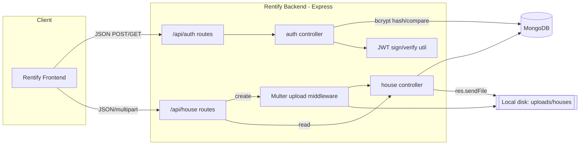
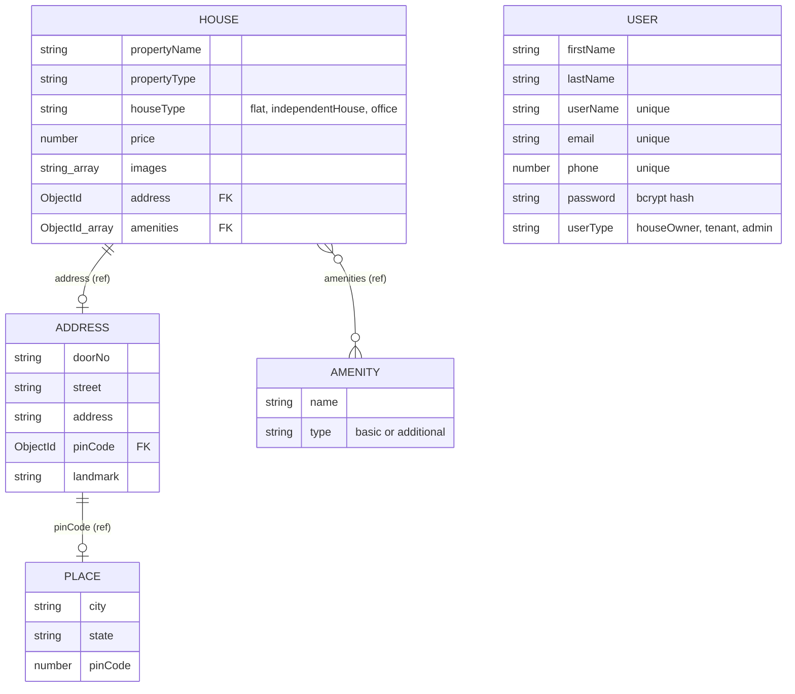
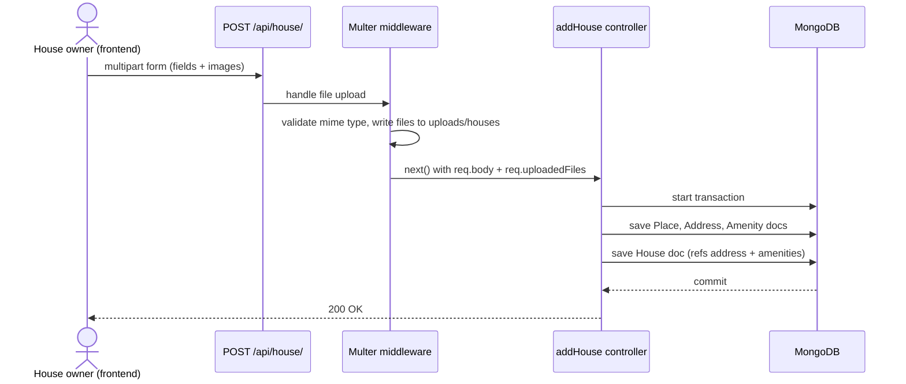

# Architecture

## System overview

`index.js` boots a single Express app, connects to MongoDB via `db/conn.js`, and mounts two
routers: `/api/auth` (`Routes/auth.js`) and `/api/house` (`Routes/house.js`). Routers delegate to
controllers (`Controllers/auth.js`, `Controllers/house.js`), which talk to Mongoose models
(`Models/user.js`, `Models/house.js`) and, for house creation, run a multer upload middleware
(`utils/fileUploads.js`) in front of the controller. There is no service or repository layer —
controllers call Mongoose models directly. There is also no auth middleware in the request path:
`utils/jwtToken.js` exports a `verifyToken` helper that no route currently imports.

## Architecture diagram

## Database schema

Built from `Models/user.js` and `Models/house.js`. `User` is a standalone collection — there is
currently no field linking a `House` back to the `User` who created it.

`USER` has no edges to `HOUSE` in the diagram above because none exist in the schema today — see
[Known limitations](#known-limitations).

## Folder-by-folder breakdown

| Path | Contents | Notes |
|---|---|---|
| `index.js` | App entry point: middleware setup (`cors`, `express.json`, `cookie-parser`), route mounting, DB connection call, server start | Also has a leftover unused `keyMappings` object and a `/test/:fileName` debug route |
| `Routes/auth.js` | `POST /api/auth/signup`, `POST /api/auth/login`, plus an unused `/test` debug route | No auth middleware |
| `Routes/house.js` | `POST /api/house/` (create, behind multer), `GET /api/house/houses` (list), `GET /api/house/:id` (detail), `GET /api/house/image/:fileName` (serve image) | No update/delete routes exist; no auth middleware |
| `Controllers/auth.js` | `signup` (dedupe check + create user), `login` (password check + issue JWT cookie) | See [Known limitations](#known-limitations) for the mass-assignment issue in `signup` |
| `Controllers/house.js` | `addHouse` (transactional multi-document create), `getHouses` (list, trimmed fields), `getHouse` (detail, populated), `getHouseImage` (static file serve) | |
| `Models/user.js` | `User` schema + bcrypt pre-save hook + `matchPassword` instance method | |
| `Models/house.js` | `House`, `Address`, `Place`, `Amenity` schemas, each its own top-level Mongoose model | Modeled as separate collections rather than embedded subdocuments |
| `db/conn.js` | Mongoose connection using `process.env.MONGO_URI`, exits process on failure | |
| `utils/jwtToken.js` | `generateToken` / `verifyToken` using `process.env.JWT_SECRET` | `verifyToken` is exported but never imported anywhere else in the codebase |
| `utils/fileUploads.js` | Configurable multer middleware factory (destination, allowed mime types, field-name mapping) | Used only for house images today |

## Data flow: create a house listing

No JWT is checked anywhere in this flow — any client, logged in or not, can hit
`POST /api/house/` successfully.

## Known limitations

- **No route protection anywhere.** `utils/jwtToken.js` exports `verifyToken`, but no route or
  middleware in the repo calls it (confirmed by searching for its usage — the only reference is
  its own definition and export). `POST /api/house/` in particular accepts new listings from
  unauthenticated requests.
- **Mass assignment in signup.** `Controllers/auth.js` builds the new user with
  `new User(req.body)`, passing the entire request body — including `userType` — straight into the
  model. A signup request can set `"userType": "admin"` directly; there is no field allowlist.
- **No owner relation on listings.** `Models/house.js`'s `houseSchema` has no field referencing the
  `User` who created it, so there is currently no way to know (or later enforce) which user owns a
  given house document. There are also no update/delete endpoints for houses yet.
- **CORS is misconfigured.** `index.js` calls `cors({ origin: "*", credentials: true })` —
  combining a wildcard origin with credentials is invalid per the CORS spec.
- **Auth cookie isn't hardened.** `Controllers/auth.js`'s `login` calls `res.cookie("token", token)`
  with no `httpOnly`, `secure`, or `sameSite` options, so the JWT is readable by client-side
  JavaScript and not restricted to HTTPS.
- **Hardcoded localhost URL.** `Controllers/house.js`'s `getHouses` builds image URLs as
  `http://localhost:3000/api/house/image/...`, which will not resolve outside local development.
- **No input validation.** Fields like `amenities` in `addHouse` are used directly
  (`amenities.split(",")`) with no check that they exist or are the expected type; a missing field
  produces a generic 500 rather than a clear validation error.
- **No automated tests or CI.** `package.json`'s `test` script is a placeholder
  (`echo "Error: no test specified" && exit 1`); there is no CI configuration in the repo.
- **Positives:** passwords are bcrypt-hashed before storage (`Models/user.js`), never stored
  plaintext, and no `.env` file or hardcoded credentials/connection strings are committed to the
  repository or its history.
